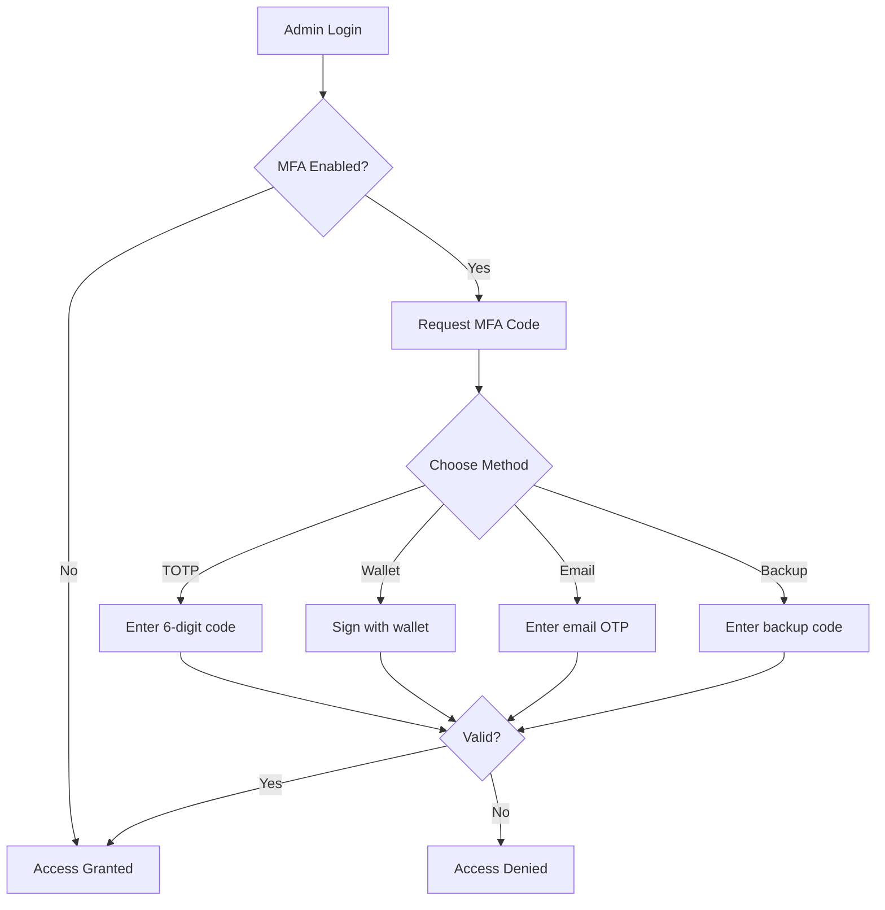

# 🔐 GigChain Admin MFA & Security System - Complete Guide

**Date:** October 8, 2025  
**Version:** 1.0.0  
**Author:** GigChain Development Team

---

## 📋 Table of Contents

1. [Overview](#overview)
2. [Features Implemented](#features-implemented)
3. [Architecture](#architecture)
4. [MFA System](#mfa-system)
5. [Troubleshooting GUI](#troubleshooting-gui)
6. [API Endpoints](#api-endpoints)
7. [Security Features](#security-features)
8. [Setup Guide](#setup-guide)
9. [Usage Examples](#usage-examples)
10. [Testing](#testing)

---

## 🎯 Overview

This document describes the **Multi-Factor Authentication (MFA)** and **Troubleshooting System** implemented for GigChain admin panel. The system provides **extra security layers** for admin accounts with:

- ✅ **TOTP-based MFA** (Google Authenticator, Authy compatible)
- ✅ **Wallet-based authentication** (Web3 wallet signature)
- ✅ **Email OTP** (One-Time Password)
- ✅ **Backup recovery codes**
- ✅ **Comprehensive troubleshooting GUI**
- ✅ **Real-time system diagnostics**

### Key Highlights

- 🔒 **Zero third-party dependencies** for MFA (all in-house)
- 🔗 **Wallet linked to email** for secure admin authentication
- 📊 **Full activity logging** for security auditing
- 🛠️ **Troubleshooting dashboard** for system health monitoring
- ⚡ **W-CSAP integration** for wallet signature verification

---

## 🚀 Features Implemented

### 1. Multi-Factor Authentication (MFA)

#### **TOTP (Time-based One-Time Password)**
- Standard TOTP implementation compatible with:
  - Google Authenticator
  - Authy
  - Microsoft Authenticator
  - Any RFC 6238 compliant app
- QR code generation for easy setup
- Manual secret key entry option
- 30-second validity window with ±1 window tolerance

#### **Wallet-based Authentication**
- Link admin wallet address to email
- W-CSAP protocol integration
- Signature verification for authentication
- Single wallet per admin (no duplicates)

#### **Email OTP**
- 6-digit one-time password
- 10-minute validity
- Single-use codes
- Secure hash storage

#### **Backup Recovery Codes**
- 10 unique recovery codes per admin
- Downloadable as text file
- Single-use protection
- Secure hashed storage

### 2. Troubleshooting System

#### **Services Status Monitor**
- Real-time service health checks
- Database connectivity verification
- OpenAI API status
- W-CSAP authentication status
- Admin MFA system status
- Overall system health indicator

#### **System Logs Viewer**
- Filter by log level (ERROR, WARNING, INFO, ALL)
- Last 100 log entries
- Real-time refresh capability
- Syntax-highlighted console view

#### **Error Tracking**
- Recent errors display
- Error type categorization
- Timestamp tracking
- Stack trace viewer

#### **System Diagnostics**
- Platform information
- Python version and architecture
- Environment configuration
- Database status
- Security configuration status
- Table existence verification

---

## 🏗️ Architecture

### Database Schema

#### **admin_mfa_settings**
```sql
CREATE TABLE admin_mfa_settings (
    admin_id TEXT PRIMARY KEY,
    mfa_enabled INTEGER DEFAULT 0,
    totp_secret TEXT,
    wallet_address TEXT,
    wallet_email TEXT,
    backup_codes_hash TEXT,
    last_used_method TEXT,
    created_at TEXT NOT NULL,
    updated_at TEXT NOT NULL
);
```

#### **admin_mfa_attempts**
```sql
CREATE TABLE admin_mfa_attempts (
    attempt_id INTEGER PRIMARY KEY AUTOINCREMENT,
    admin_id TEXT NOT NULL,
    method TEXT NOT NULL,
    success INTEGER NOT NULL,
    ip_address TEXT,
    user_agent TEXT,
    timestamp TEXT NOT NULL
);
```

#### **admin_mfa_pending**
```sql
CREATE TABLE admin_mfa_pending (
    verification_id TEXT PRIMARY KEY,
    admin_id TEXT NOT NULL,
    method TEXT NOT NULL,
    code_hash TEXT NOT NULL,
    created_at TEXT NOT NULL,
    expires_at TEXT NOT NULL,
    used INTEGER DEFAULT 0
);
```

#### **admin_wallets**
```sql
CREATE TABLE admin_wallets (
    wallet_address TEXT PRIMARY KEY,
    admin_id TEXT NOT NULL,
    email TEXT NOT NULL,
    verified INTEGER DEFAULT 0,
    created_at TEXT NOT NULL,
    last_used TEXT
);
```

### File Structure

```
/workspace/
├── admin_mfa_system.py          # MFA backend logic
├── admin_api.py                 # Admin API with MFA endpoints
├── admin_system.py              # Admin management system
├── admin-panel/                 # Frontend React app
│   └── src/
│       └── pages/
│           ├── SecurityPage.jsx      # MFA setup page
│           ├── SecurityPage.css      # MFA page styles
│           ├── TroubleshootPage.jsx  # Troubleshooting page
│           └── TroubleshootPage.css  # Troubleshooting styles
└── ADMIN_MFA_SECURITY_GUIDE.md  # This document
```

---

## 🔐 MFA System

### Setup Flow



### TOTP Implementation

```python
import pyotp

# Generate secret
totp_secret = pyotp.random_base32()

# Create TOTP instance
totp = pyotp.TOTP(totp_secret)

# Generate current code
current_code = totp.now()

# Verify code with tolerance
is_valid = totp.verify(user_code, valid_window=1)
```

### QR Code Generation

```python
import qrcode

# Generate provisioning URI
totp_uri = pyotp.totp.TOTP(secret).provisioning_uri(
    name=email,
    issuer_name="GigChain Admin"
)

# Create QR code
qr = qrcode.QRCode(version=1, box_size=10, border=5)
qr.add_data(totp_uri)
qr.make(fit=True)

# Generate image
img = qr.make_image(fill_color="black", back_color="white")
```

### Wallet Verification

```python
from auth.w_csap import verify_signature

# Verify wallet signature
success = verify_signature(
    message=challenge_message,
    signature=signed_message,
    wallet_address=admin_wallet
)
```

---

## 🛠️ Troubleshooting GUI

### Services Status

**Endpoint:** `/api/admin/troubleshoot/services`

Checks:
- ✅ Database connectivity
- ✅ OpenAI API configuration
- ✅ W-CSAP authentication system
- ✅ Admin MFA system
- ✅ Overall health status

**Response:**
```json
{
  "success": true,
  "overall_status": "healthy",
  "services": {
    "database": {
      "status": "healthy",
      "message": "Database connection OK"
    },
    "openai": {
      "status": "healthy",
      "message": "OpenAI API configured"
    },
    "wcsap_auth": {
      "status": "healthy",
      "message": "W-CSAP authentication system OK"
    },
    "admin_mfa": {
      "status": "healthy",
      "message": "MFA system operational"
    }
  }
}
```

### System Logs

**Endpoint:** `/api/admin/troubleshoot/logs`

Parameters:
- `level`: ERROR, WARNING, INFO, ALL (default: ERROR)
- `limit`: Number of log entries (default: 100)

### Diagnostics

**Endpoint:** `/api/admin/troubleshoot/diagnostics`

Returns:
- System information
- Environment variables
- Database status
- Security configuration

---

## 📡 API Endpoints

### MFA Endpoints

#### 1. Setup MFA
```http
POST /api/admin/mfa/setup
Authorization: Bearer {admin_token}
```

**Response:**
```json
{
  "success": true,
  "message": "MFA setup initiated",
  "qr_code": "data:image/png;base64,...",
  "secret": "JBSWY3DPEHPK3PXP",
  "backup_codes": [
    "ABC123",
    "DEF456",
    ...
  ]
}
```

#### 2. Enable MFA
```http
POST /api/admin/mfa/enable
Authorization: Bearer {admin_token}
Content-Type: application/json

{
  "admin_id": "admin_123",
  "code": "123456",
  "method": "totp"
}
```

#### 3. Verify MFA
```http
POST /api/admin/mfa/verify
Content-Type: application/json

{
  "admin_id": "admin_123",
  "code": "123456",
  "method": "totp"
}
```

#### 4. Link Wallet
```http
POST /api/admin/mfa/wallet/link
Authorization: Bearer {admin_token}
Content-Type: application/json

{
  "wallet_address": "0x742d35Cc6634C0532925a3b844Bc9e7595f0bEb",
  "email": "admin@gigchain.io"
}
```

#### 5. Verify Wallet Signature
```http
POST /api/admin/mfa/wallet/verify
Content-Type: application/json

{
  "wallet_address": "0x742d35Cc6634C0532925a3b844Bc9e7595f0bEb",
  "signature": "0x...",
  "message": "GigChain Admin Login: ..."
}
```

#### 6. Get MFA Methods
```http
GET /api/admin/mfa/methods
Authorization: Bearer {admin_token}
```

#### 7. Get MFA Stats
```http
GET /api/admin/mfa/stats
Authorization: Bearer {admin_token}
```

#### 8. Disable MFA (Super Admin Only)
```http
POST /api/admin/mfa/disable
Authorization: Bearer {super_admin_token}
```

### Troubleshooting Endpoints

#### 1. Check Services
```http
GET /api/admin/troubleshoot/services
Authorization: Bearer {admin_token}
```

#### 2. Get System Logs
```http
GET /api/admin/troubleshoot/logs?level=ERROR&limit=100
Authorization: Bearer {admin_token}
```

#### 3. Get Recent Errors
```http
GET /api/admin/troubleshoot/errors?limit=50
Authorization: Bearer {admin_token}
```

#### 4. Run Diagnostics
```http
GET /api/admin/troubleshoot/diagnostics
Authorization: Bearer {admin_token}
```

---

## 🔒 Security Features

### 1. MFA Protection
- **TOTP codes**: 30-second validity, ±1 window tolerance
- **Email OTP**: 10-minute validity, single-use
- **Backup codes**: Single-use, hashed storage
- **Wallet signatures**: W-CSAP protocol verification

### 2. Activity Logging
All MFA attempts are logged:
- Admin ID
- Method used (TOTP, wallet, email, backup)
- Success/failure status
- IP address
- User agent
- Timestamp

### 3. Session Security
- Token-based authentication
- 8-hour session expiration
- Secure token storage
- Session invalidation on logout

### 4. Database Security
- All sensitive data hashed (SHA-256)
- Single-use code enforcement
- Expiration time validation
- Foreign key constraints

---

## 🚀 Setup Guide

### 1. Install Dependencies

```bash
pip install -r requirements.txt
```

Required packages:
- `pyotp==2.9.0` - TOTP implementation
- `qrcode==7.4.2` - QR code generation
- `pillow==10.4.0` - Image processing

### 2. Initialize Database

The database will be automatically initialized when you start the server:

```bash
python main.py
```

This creates:
- `admin.db` with all MFA tables
- Default super admin account:
  - Username: `admin`
  - Password: `admin123`
  - ⚠️ **Change this immediately in production!**

### 3. Access Admin Panel

1. Navigate to admin panel:
   ```
   http://localhost:5000/admin-panel/
   ```

2. Login with default credentials (first time only):
   ```
   Username: admin
   Password: admin123
   ```

3. Go to Security Settings:
   ```
   Click "Security" in sidebar
   ```

### 4. Setup MFA

#### Option 1: TOTP (Recommended)

1. Click "Setup MFA" button
2. Scan QR code with authenticator app:
   - Google Authenticator
   - Authy
   - Microsoft Authenticator
3. Download and save backup codes
4. Enter 6-digit code from app
5. Click "Enable MFA"

#### Option 2: Wallet Authentication

1. Go to "Wallet Authentication" tab
2. Enter your wallet address (0x...)
3. Enter your admin email
4. Click "Link Wallet"
5. Verify wallet signature via W-CSAP

### 5. Test MFA

1. Logout from admin panel
2. Login again with username/password
3. System will request MFA code
4. Enter code from authenticator app
5. Access granted ✅

---

## 📖 Usage Examples

### Example 1: Enable MFA with TOTP

```javascript
// Frontend - Setup MFA
const setupMFA = async () => {
  const response = await fetch('/api/admin/mfa/setup', {
    method: 'POST',
    headers: {
      'Authorization': `Bearer ${adminToken}`,
      'Content-Type': 'application/json'
    }
  });
  
  const data = await response.json();
  
  // Display QR code
  console.log('QR Code:', data.qr_code);
  console.log('Secret:', data.secret);
  console.log('Backup Codes:', data.backup_codes);
  
  // User scans QR and enters code
  const verificationCode = prompt('Enter code from app:');
  
  // Enable MFA
  const enableResponse = await fetch('/api/admin/mfa/enable', {
    method: 'POST',
    headers: {
      'Authorization': `Bearer ${adminToken}`,
      'Content-Type': 'application/json'
    },
    body: JSON.stringify({
      admin_id: adminId,
      code: verificationCode,
      method: 'totp'
    })
  });
  
  const result = await enableResponse.json();
  console.log('MFA Enabled:', result.success);
};
```

### Example 2: Link Wallet

```javascript
// Frontend - Link Wallet
const linkWallet = async (walletAddress, email) => {
  const response = await fetch('/api/admin/mfa/wallet/link', {
    method: 'POST',
    headers: {
      'Authorization': `Bearer ${adminToken}`,
      'Content-Type': 'application/json'
    },
    body: JSON.stringify({
      wallet_address: walletAddress,
      email: email
    })
  });
  
  const data = await response.json();
  
  if (data.success) {
    console.log('✅ Wallet linked successfully');
  } else {
    console.error('❌ Failed to link wallet:', data.detail);
  }
};
```

### Example 3: Verify MFA on Login

```javascript
// Frontend - Login with MFA
const loginWithMFA = async (username, password, mfaCode) => {
  // Step 1: Regular login
  const loginResponse = await fetch('/api/admin/login', {
    method: 'POST',
    headers: { 'Content-Type': 'application/json' },
    body: JSON.stringify({ username, password })
  });
  
  const loginData = await loginResponse.json();
  
  if (!loginData.success) {
    console.error('Login failed');
    return;
  }
  
  // Step 2: MFA verification (if enabled)
  if (loginData.requires_mfa) {
    const mfaResponse = await fetch('/api/admin/mfa/verify', {
      method: 'POST',
      headers: { 'Content-Type': 'application/json' },
      body: JSON.stringify({
        admin_id: loginData.admin.admin_id,
        code: mfaCode,
        method: 'totp'
      })
    });
    
    const mfaData = await mfaResponse.json();
    
    if (mfaData.success) {
      console.log('✅ Login successful with MFA');
      return loginData.token;
    } else {
      console.error('❌ Invalid MFA code');
      return null;
    }
  }
  
  // No MFA required
  return loginData.token;
};
```

### Example 4: Check System Health

```javascript
// Frontend - Check Services Status
const checkServices = async () => {
  const response = await fetch('/api/admin/troubleshoot/services', {
    headers: {
      'Authorization': `Bearer ${adminToken}`
    }
  });
  
  const data = await response.json();
  
  console.log('Overall Status:', data.overall_status);
  
  // Check each service
  Object.entries(data.services).forEach(([name, service]) => {
    console.log(`${name}: ${service.status} - ${service.message}`);
  });
};
```

---

## 🧪 Testing

### Manual Testing Checklist

#### MFA Setup
- [ ] Setup MFA with TOTP
- [ ] Scan QR code with authenticator app
- [ ] Download backup codes
- [ ] Verify 6-digit code
- [ ] Enable MFA successfully

#### MFA Login
- [ ] Login with username/password
- [ ] Enter TOTP code
- [ ] Login successful with MFA
- [ ] Test with invalid code (should fail)
- [ ] Test with expired code (should fail)

#### Wallet Authentication
- [ ] Link wallet to admin account
- [ ] Verify wallet signature
- [ ] Test with invalid signature (should fail)
- [ ] Test with wrong wallet (should fail)

#### Troubleshooting
- [ ] View services status
- [ ] Check system logs
- [ ] View recent errors
- [ ] Run diagnostics
- [ ] Refresh data in real-time

### Automated Testing

```bash
# Install test dependencies
pip install pytest pytest-asyncio

# Run tests
pytest tests/test_admin_mfa.py -v

# Run with coverage
pytest tests/test_admin_mfa.py --cov=admin_mfa_system
```

### Test Script Example

```python
# tests/test_admin_mfa.py
import pytest
from admin_mfa_system import admin_mfa_system

def test_mfa_setup():
    """Test MFA setup flow"""
    setup = admin_mfa_system.setup_mfa(
        admin_id="test_admin",
        email="test@gigchain.io",
        username="testadmin"
    )
    
    assert setup.secret is not None
    assert setup.qr_code is not None
    assert len(setup.backup_codes) == 10

def test_totp_verification():
    """Test TOTP code verification"""
    import pyotp
    
    # Setup MFA
    setup = admin_mfa_system.setup_mfa(
        admin_id="test_admin",
        email="test@gigchain.io",
        username="testadmin"
    )
    
    # Generate valid code
    totp = pyotp.TOTP(setup.secret)
    valid_code = totp.now()
    
    # Enable MFA
    enabled = admin_mfa_system.enable_mfa("test_admin", valid_code)
    assert enabled is True
    
    # Verify code
    verified = admin_mfa_system.verify_totp("test_admin", valid_code)
    assert verified is True

def test_wallet_linking():
    """Test wallet linking"""
    success = admin_mfa_system.link_wallet(
        admin_id="test_admin",
        wallet_address="0x742d35Cc6634C0532925a3b844Bc9e7595f0bEb",
        email="test@gigchain.io"
    )
    
    assert success is True
```

---

## 📊 Security Best Practices

### For Administrators

1. **Always enable MFA** - Use TOTP as primary method
2. **Save backup codes** - Store in a secure location (password manager)
3. **Link your wallet** - Additional security layer
4. **Monitor activity logs** - Check for suspicious attempts
5. **Use strong passwords** - Minimum 12 characters
6. **Regular security audits** - Review MFA stats monthly

### For Developers

1. **Never log sensitive data** - TOTP secrets, backup codes, signatures
2. **Use secure hashing** - SHA-256 for all stored codes
3. **Implement rate limiting** - Prevent brute force attacks
4. **Validate all inputs** - Strict validation on wallet addresses, codes
5. **Keep dependencies updated** - Regular security updates
6. **Monitor failed attempts** - Alert on suspicious activity

---

## 🔍 Troubleshooting Common Issues

### Issue 1: QR Code Not Displaying

**Solution:**
```javascript
// Check if qr_code is base64 encoded
if (data.qr_code.startsWith('data:image/png;base64,')) {
  // Use directly
  
} else {
  // Add prefix
  
}
```

### Issue 2: TOTP Code Always Invalid

**Possible causes:**
- Time sync issue on server or client device
- Wrong secret key
- Invalid window tolerance

**Solution:**
```python
# Increase tolerance window
totp.verify(code, valid_window=2)  # Allow ±60 seconds

# Check system time
import datetime
print(datetime.datetime.now())
```

### Issue 3: Wallet Signature Verification Fails

**Solution:**
```python
# Check wallet address format
assert wallet_address.startswith('0x')
assert len(wallet_address) == 42

# Verify message format
message = f"GigChain Admin Login: {timestamp}"

# Check W-CSAP integration
from auth.w_csap import verify_signature
success = verify_signature(message, signature, wallet_address)
```

### Issue 4: Services Status Shows Error

**Solution:**
1. Check database connectivity:
   ```bash
   sqlite3 admin.db "SELECT COUNT(*) FROM admin_users;"
   ```

2. Verify OpenAI API key:
   ```bash
   echo $OPENAI_API_KEY
   ```

3. Check W-CSAP configuration:
   ```bash
   echo $W_CSAP_SECRET_KEY
   ```

---

## 📚 Additional Resources

### Documentation
- [W-CSAP Protocol](./WCSAP_RFC_COMPLETE.md)
- [Admin System Guide](./ADMIN_PANEL_COMPLETE.md)
- [Security Assessment](./SECURITY_ASSESSMENT_2025-10-07.md)

### External Links
- [RFC 6238 - TOTP](https://tools.ietf.org/html/rfc6238)
- [pyotp Documentation](https://pyauth.github.io/pyotp/)
- [QR Code Standard](https://www.qrcode.com/en/)

### Support
- **Email:** admin@gigchain.io
- **Discord:** [GigChain Community](https://discord.gg/gigchain)
- **GitHub:** [github.com/gigchain/platform](https://github.com/gigchain)

---

## 📝 Changelog

### Version 1.0.0 (October 8, 2025)
- ✅ Initial release
- ✅ TOTP-based MFA implementation
- ✅ Wallet authentication integration
- ✅ Email OTP support
- ✅ Backup recovery codes
- ✅ Troubleshooting GUI
- ✅ System diagnostics
- ✅ Activity logging
- ✅ Security stats dashboard

---

## 🤝 Contributing

We welcome contributions! Please see our [Contributing Guide](./CONTRIBUTING.md) for details.

### Development Setup

```bash
# Clone repository
git clone https://github.com/gigchain/platform.git

# Install dependencies
pip install -r requirements.txt
pip install -r requirements-dev.txt

# Run development server
python main.py

# Run tests
pytest tests/ -v
```

---

## 📄 License

This project is licensed under the MIT License - see the [LICENSE](./LICENSE) file for details.

---

## ⚠️ Security Disclosure

If you discover a security vulnerability, please email us at **security@gigchain.io**. Do not open public issues for security concerns.

---

**End of Document**

*Last Updated: October 8, 2025*  
*Document Version: 1.0.0*
