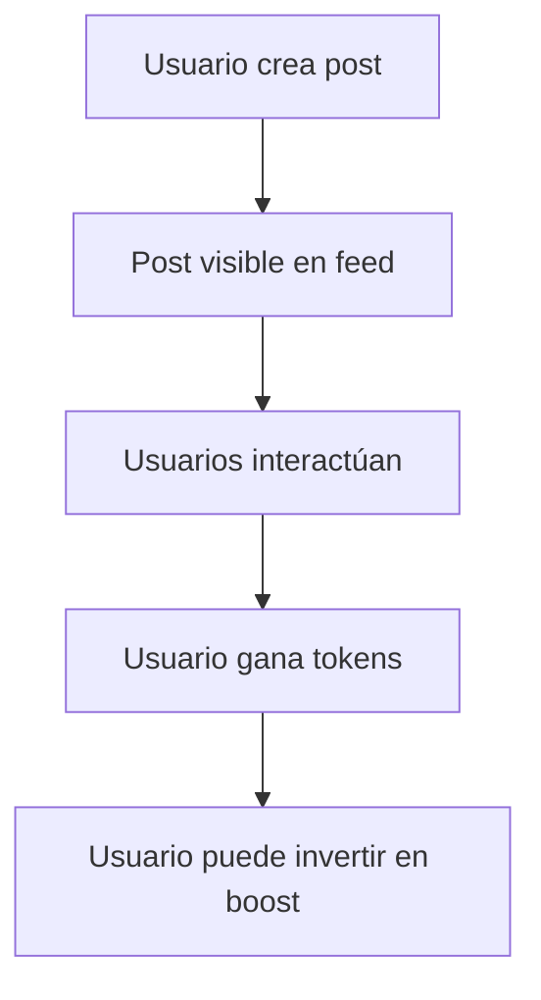
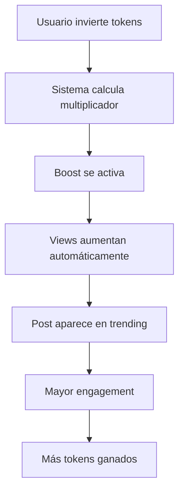
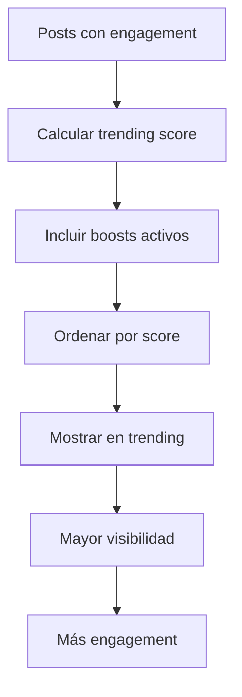

# 🚀 GigChain Engagement System con GigSoul Tokens

Sistema completo de engagement que permite a los usuarios **invertir tokens GigSoul para aumentar las views** de sus publicaciones y ganar recompensas por interactuar.

## 🎯 Características Principales

### **💎 Sistema de Boost con Tokens**
- ✅ **Boost de Views** - Aumenta views con tokens GigSoul
- ✅ **Boost de Visibilidad** - Mejora posición en el feed
- ✅ **Boost Trending** - Aparece en sección trending
- ✅ **Posición Premium** - Destacado en el feed principal

### **💰 Recompensas por Engagement**
- ✅ **Views** - 0.1 GigSoul por view
- ✅ **Likes** - 0.5 GigSoul por like
- ✅ **Comentarios** - 2.0 GigSoul por comentario
- ✅ **Shares** - 1.0 GigSoul por share
- ✅ **Bookmarks** - 0.3 GigSoul por bookmark

### **📊 Analytics Avanzados**
- ✅ **Analytics de Post** - Views, engagement, tokens ganados
- ✅ **Analytics de Usuario** - Score de engagement, ROI
- ✅ **Posts Trending** - Algoritmo basado en engagement
- ✅ **Posts Boosted** - Lista de publicaciones con boosts activos

## 🏗️ Arquitectura del Sistema

### **Backend (FastAPI)**
```
engagement_system.py     # Lógica principal del sistema
engagement_api.py        # API endpoints
```

### **Frontend (React + TypeScript)**
```
components/EngagementBoost/        # Componente de boost
components/EngagementAnalytics/    # Analytics detallados
pages/Feed/EnhancedFeed.tsx        # Feed mejorado con engagement
```

## 💡 Cómo Funciona

### **1. Sistema de Boost**
```typescript
// Usuario invierte tokens para boost
const boostRequest = {
  post_id: "post_123",
  boost_type: "views_boost",
  tokens_invested: 50.0  // 50 GigSoul tokens
};

// El sistema calcula:
// - Multiplicador: 5.0x (basado en tokens)
// - Views estimadas: 500
// - Duración: 24 horas
// - Precio total: 50 GigSoul
```

### **2. Recompensas por Engagement**
```typescript
// Cada interacción genera tokens
const engagement = {
  post_id: "post_123",
  engagement_type: "like"  // +0.5 GigSoul
};

// El sistema registra y recompensa
// - Usuario gana 0.5 GigSoul
// - Post aumenta engagement rate
// - Analytics se actualizan
```

### **3. Algoritmo de Trending**
```typescript
// Score de trending basado en:
const trendingScore = (
  totalViews * 0.3 +
  totalLikes * 0.4 +
  totalComments * 0.2 +
  totalShares * 0.1 +
  boostedViews * 0.5  // Bonus por boosts
);
```

## 🛠️ Instalación y Uso

### **1. Configurar Backend**
```bash
# El sistema ya está integrado en main.py
python main.py
```

### **2. Usar en Frontend**
```tsx
import EngagementBoost from './components/EngagementBoost/EngagementBoost';
import EngagementAnalytics from './components/EngagementAnalytics/EngagementAnalytics';

// En tu componente de post
<EngagementBoost 
  postId={post.id} 
  onBoostCreated={() => refreshPost()} 
/>

// Para ver analytics
<EngagementAnalytics 
  postId={post.id}
  userId={user.id}
/>
```

## 🔧 API Endpoints

### **Boost Endpoints**
```http
POST   /api/engagement/boost                    # Crear boost
GET    /api/engagement/boost/price/{type}       # Obtener precio
GET    /api/engagement/boost/active/{post_id}   # Boosts activos
```

### **Engagement Endpoints**
```http
POST   /api/engagement/record                   # Registrar engagement
GET    /api/engagement/analytics/post/{id}      # Analytics de post
GET    /api/engagement/analytics/user/{id}      # Analytics de usuario
```

### **Trending Endpoints**
```http
GET    /api/engagement/trending                 # Posts trending
GET    /api/engagement/trending/boosted         # Posts con boosts
```

## 💰 Precios de Boost

### **Boost de Views**
- **Precio base**: 10 GigSoul
- **Multiplicador**: 0.1x por token
- **Máximo**: 5.0x
- **Duración**: 24 horas
- **Views estimadas**: ~10 por token

### **Boost de Visibilidad**
- **Precio base**: 25 GigSoul
- **Multiplicador**: 0.05x por token
- **Máximo**: 3.0x
- **Duración**: 48 horas

### **Boost Trending**
- **Precio base**: 50 GigSoul
- **Multiplicador**: 0.02x por token
- **Máximo**: 2.0x
- **Duración**: 72 horas

### **Posición Premium**
- **Precio base**: 100 GigSoul
- **Multiplicador**: 0.01x por token
- **Máximo**: 1.5x
- **Duración**: 168 horas (1 semana)

## 📊 Ejemplos de Uso

### **Ejemplo 1: Boost Básico**
```typescript
// Usuario quiere aumentar views de su post
const boost = await createBoost({
  postId: "post_123",
  boostType: "views_boost",
  tokensInvested: 25.0
});

// Resultado:
// - Multiplicador: 2.5x
// - Views estimadas: 250
// - Duración: 24 horas
// - Precio: 25 GigSoul
```

### **Ejemplo 2: Estrategia de Marketing**
```typescript
// Usuario invierte en múltiples boosts
const strategy = [
  { type: "views_boost", tokens: 50 },      // 500 views
  { type: "visibility_boost", tokens: 100 }, // Mejor posición
  { type: "trending_boost", tokens: 200 }   // Aparece en trending
];

// Resultado total:
// - Inversión: 350 GigSoul
// - Views estimadas: 1,000+
// - Posición: Trending + Premium
// - Duración: 72 horas
```

### **Ejemplo 3: Analytics Detallados**
```typescript
// Obtener analytics completos
const analytics = await getPostAnalytics("post_123");

// Resultado:
{
  totalViews: 1250,
  organicViews: 800,
  boostedViews: 450,
  engagementRate: 12.5,
  tokensEarned: 45.2,
  tokensSpent: 150.0,
  activeBoosts: 2,
  boostDetails: [...]
}
```

## 🎮 Gamificación

### **Sistema de Puntos**
- **Engagement Score**: 0-100 basado en actividad
- **ROI de Tokens**: Eficiencia de inversión
- **Leaderboards**: Usuarios más activos
- **Badges**: Logros por engagement

### **Recompensas Diarias**
- **Login diario**: +5 GigSoul
- **Primer post del día**: +10 GigSoul
- **10 interacciones**: +5 GigSoul
- **Post trending**: +25 GigSoul

## 🔄 Flujo Completo

### **1. Usuario Crea Post**


### **2. Sistema de Boost**


### **3. Algoritmo de Trending**


## 🧪 Testing

### **Ejecutar Tests**
```bash
# Test completo del sistema
python test_engagement_system.py

# Test específico de boost
python -m pytest tests/test_boost_system.py

# Test de analytics
python -m pytest tests/test_analytics.py
```

### **Test de Carga**
```bash
# Simular múltiples usuarios boosteando
python test_load_engagement.py
```

## 📈 Métricas y KPIs

### **Métricas del Sistema**
- **Total de boosts creados**
- **Tokens invertidos en boosts**
- **Views generadas por boosts**
- **ROI promedio de usuarios**
- **Posts trending por día**

### **Métricas de Usuario**
- **Engagement score personal**
- **Tokens ganados vs gastados**
- **Eficiencia de boosts**
- **Posts más exitosos**

## 🚀 Próximas Características

### **Funcionalidades Planificadas**
- [ ] **Boost Automático** - AI que sugiere cuándo boostear
- [ ] **Boost Colaborativo** - Múltiples usuarios boostean juntos
- [ ] **Boost Programado** - Boosts en horarios específicos
- [ ] **Análisis Predictivo** - Predicción de engagement
- [ ] **Boost de Competencia** - Desafíos entre usuarios

### **Mejoras de UX**
- [ ] **Dashboard de Analytics** - Vista completa de métricas
- [ ] **Notificaciones Push** - Alertas de engagement
- [ ] **Gráficos en Tiempo Real** - Visualización live
- [ ] **Exportar Datos** - Descargar analytics
- [ ] **Comparar Posts** - Benchmarking

## 🔐 Seguridad

### **Validaciones**
- ✅ Verificación de tokens suficientes
- ✅ Límites de boost por usuario
- ✅ Prevención de spam
- ✅ Rate limiting en API

### **Privacidad**
- ✅ Datos de engagement anónimos
- ✅ Analytics agregados
- ✅ No tracking personal

## 📞 Soporte

### **Documentación**
- [API Documentation](docs/engagement_api.md)
- [Frontend Components](docs/engagement_components.md)
- [Analytics Guide](docs/analytics_guide.md)

### **Comunidad**
- Discord: [GigChain Community](https://discord.gg/gigchain)
- GitHub Issues: [Reportar bugs](https://github.com/gigchain/issues)
- Email: support@gigchain.io

---

**Desarrollado con ❤️ por el equipo de GigChain.io**

*Sistema de engagement con tokens GigSoul para maximizar el alcance de tus publicaciones*