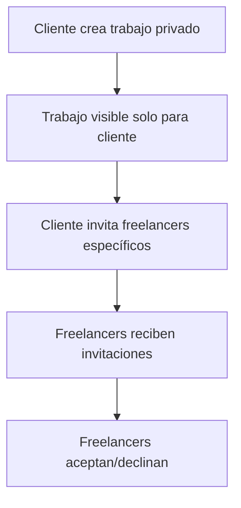
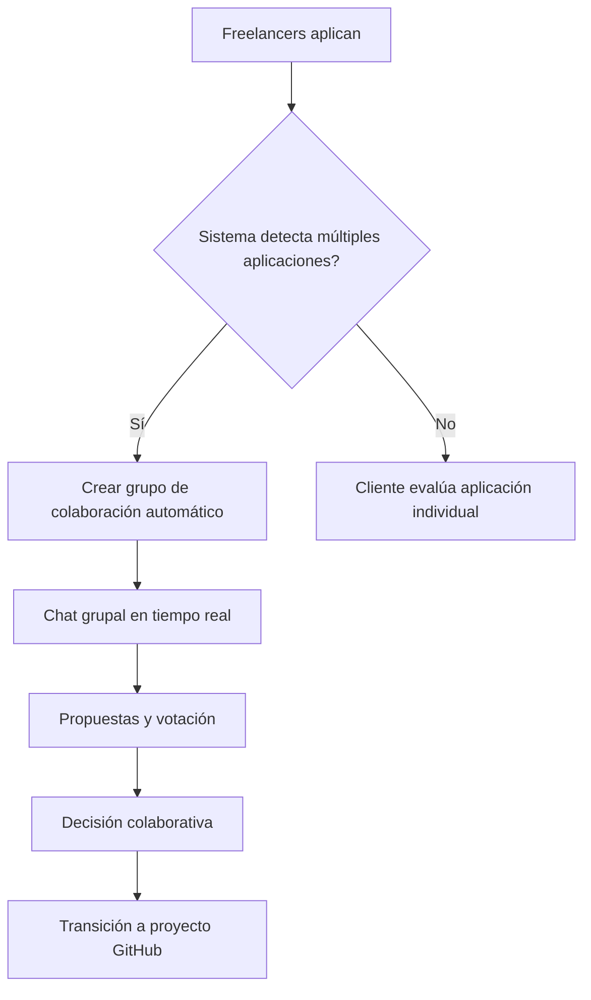
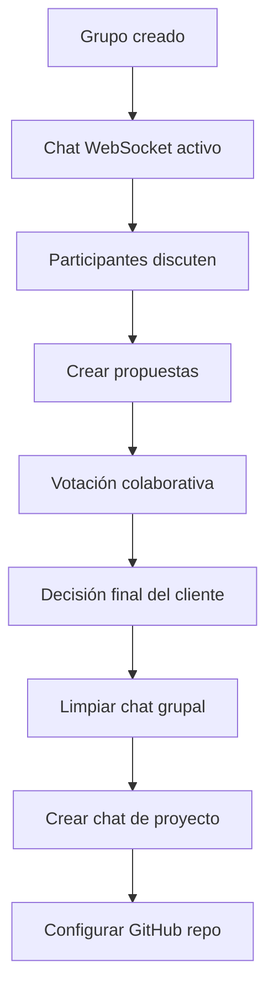

# 🔒 GigChain Private Jobs System

Sistema completo de trabajos privados con grupos de colaboración automáticos para GigChain.io

## 🚀 Características Principales

### **Trabajos Privados**
- ✅ Creación de trabajos privados (solo visible para el cliente)
- ✅ Invitaciones específicas a freelancers
- ✅ Aplicaciones solo para freelancers invitados
- ✅ Gestión completa del ciclo de vida del trabajo

### **Grupos de Colaboración Automáticos**
- ✅ Creación automática cuando hay múltiples aplicaciones
- ✅ Chat grupal en tiempo real con WebSocket
- ✅ Sistema de propuestas y votación
- ✅ Decisión colaborativa del equipo final
- ✅ Transición automática a proyecto GitHub

### **Privacidad Total**
- ✅ Trabajos invisibles en búsquedas públicas
- ✅ Acceso restringido solo a participantes
- ✅ Chat encriptado y seguro
- ✅ Repositorios GitHub privados

## 🏗️ Arquitectura del Sistema

### **Backend (FastAPI)**
```
private_jobs_api.py          # API principal
models/private_jobs.py       # Modelos de base de datos
schemas/private_jobs.py      # Esquemas Pydantic
```

### **Frontend (React + TypeScript)**
```
frontend/src/pages/PrivateJobs/           # Gestión de trabajos
frontend/src/pages/CollaborationGroup/    # Grupos de colaboración
frontend/src/pages/Invitations/           # Invitaciones
frontend/src/pages/PrivateJobApplication/ # Aplicaciones
```

### **Smart Contracts (Solidity)**
```
contracts/GigChainPrivateJobs.sol  # Contrato principal
```

## 📊 Flujo del Sistema

### **1. Creación de Trabajo Privado**


### **2. Aplicaciones y Grupos**


### **3. Chat Grupal y Decisión**


## 🛠️ Instalación y Configuración

### **1. Configurar Base de Datos**
```bash
# Ejecutar script de configuración
python database_setup.py
```

### **2. Instalar Dependencias**
```bash
# Backend
pip install -r requirements.txt

# Frontend
cd frontend
npm install
```

### **3. Configurar Variables de Entorno**
```env
# .env
DATABASE_URL=sqlite:///gigchain.db
WEBSOCKET_URL=ws://localhost:5000
GITHUB_TOKEN=your_github_token
```

### **4. Ejecutar Servidor**
```bash
# Backend
python main.py

# Frontend
cd frontend
npm run dev
```

## 🔧 API Endpoints

### **Trabajos Privados**
```http
POST   /api/private-jobs/                    # Crear trabajo
GET    /api/private-jobs/                    # Listar trabajos del cliente
GET    /api/private-jobs/{job_id}            # Obtener trabajo específico
PUT    /api/private-jobs/{job_id}            # Actualizar trabajo
```

### **Invitaciones**
```http
POST   /api/private-jobs/{job_id}/invitations           # Invitar freelancer
GET    /api/private-jobs/{job_id}/invitations           # Listar invitaciones
POST   /api/private-jobs/invitations/{id}/respond       # Responder invitación
```

### **Aplicaciones**
```http
POST   /api/private-jobs/{job_id}/apply                 # Aplicar a trabajo
GET    /api/private-jobs/{job_id}/applications          # Listar aplicaciones
```

### **Grupos de Colaboración**
```http
POST   /api/private-jobs/{job_id}/collaboration-group   # Crear grupo
GET    /api/private-jobs/{job_id}/collaboration-group   # Obtener grupo
POST   /api/private-jobs/{group_id}/decide              # Tomar decisión
```

### **Chat Grupal**
```http
WS     /ws/private-jobs/{group_id}/chat                 # WebSocket chat
GET    /api/private-jobs/{group_id}/messages            # Obtener mensajes
```

### **Propuestas**
```http
POST   /api/private-jobs/{group_id}/proposals           # Crear propuesta
GET    /api/private-jobs/{group_id}/proposals           # Listar propuestas
POST   /api/private-jobs/proposals/{id}/vote            # Votar propuesta
```

## 🧪 Testing

### **Ejecutar Tests**
```bash
# Test completo del sistema
python test_private_jobs.py

# Test individual de componentes
python -m pytest tests/test_private_jobs.py
```

### **Test de Carga**
```bash
# Simular múltiples usuarios
python test_load_private_jobs.py
```

## 📱 Interfaz de Usuario

### **Página de Trabajos Privados**
- Dashboard con estadísticas
- Lista de trabajos con filtros
- Creación de nuevos trabajos
- Gestión de invitaciones

### **Página de Grupos de Colaboración**
- Chat grupal en tiempo real
- Sistema de propuestas
- Votación colaborativa
- Transición a proyecto

### **Página de Invitaciones**
- Lista de invitaciones recibidas
- Aceptar/declinar invitaciones
- Aplicar a trabajos invitados

### **Página de Aplicación**
- Formulario de aplicación detallado
- Validación de campos
- Envío seguro de aplicaciones

## 🔐 Seguridad

### **Autenticación**
- W-CSAP protocol para autenticación Web3
- Verificación de wallet signatures
- Tokens JWT para sesiones

### **Autorización**
- Verificación de acceso a trabajos privados
- Solo participantes pueden acceder a grupos
- Validación de permisos en cada endpoint

### **Privacidad**
- Trabajos invisibles en búsquedas públicas
- Chat encriptado end-to-end
- Repositorios GitHub privados

## 🚀 Despliegue

### **Desarrollo Local**
```bash
# Backend
python main.py

# Frontend
cd frontend && npm run dev
```

### **Producción**
```bash
# Usar Docker (al final del proyecto)
docker-compose up -d
```

## 📈 Monitoreo

### **Métricas del Sistema**
- Número de trabajos privados creados
- Tasa de aceptación de invitaciones
- Tiempo promedio de decisión en grupos
- Actividad del chat grupal

### **Logs**
- Logs de creación de trabajos
- Logs de invitaciones y respuestas
- Logs de actividad de grupos
- Logs de errores y excepciones

## 🔄 Flujo de Datos

### **Creación de Trabajo**
1. Cliente crea trabajo privado
2. Trabajo se guarda en base de datos
3. Trabajo se registra en smart contract
4. Cliente invita freelancers

### **Aplicación y Grupo**
1. Freelancers aplican al trabajo
2. Sistema detecta múltiples aplicaciones
3. Se crea grupo de colaboración automático
4. Se activa chat grupal WebSocket

### **Decisión y Proyecto**
1. Participantes discuten en chat
2. Se crean y votan propuestas
3. Cliente toma decisión final
4. Se limpia chat y se crea proyecto GitHub

## 🎯 Próximas Características

### **Funcionalidades Planificadas**
- [ ] Integración con GitHub Actions
- [ ] Notificaciones push en tiempo real
- [ ] Sistema de reputación para grupos
- [ ] Análisis de sentimientos en chat
- [ ] Integración con herramientas de desarrollo
- [ ] Sistema de milestones automáticos

### **Mejoras de UX**
- [ ] Drag & drop para archivos
- [ ] Emojis y reacciones en chat
- [ ] Notificaciones de actividad
- [ ] Modo oscuro mejorado
- [ ] Responsive design optimizado

## 🤝 Contribución

### **Cómo Contribuir**
1. Fork del repositorio
2. Crear branch para feature
3. Implementar cambios
4. Ejecutar tests
5. Crear pull request

### **Estándares de Código**
- TypeScript para frontend
- Python con type hints para backend
- Solidity con comentarios Natspec
- Tests con cobertura > 80%

## 📞 Soporte

### **Documentación**
- [API Documentation](docs/api.md)
- [Frontend Components](docs/frontend.md)
- [Smart Contracts](docs/contracts.md)

### **Comunidad**
- Discord: [GigChain Community](https://discord.gg/gigchain)
- GitHub Issues: [Reportar bugs](https://github.com/gigchain/issues)
- Email: support@gigchain.io

---

**Desarrollado con ❤️ por el equipo de GigChain.io**

*Sistema de trabajos privados con grupos de colaboración automáticos*