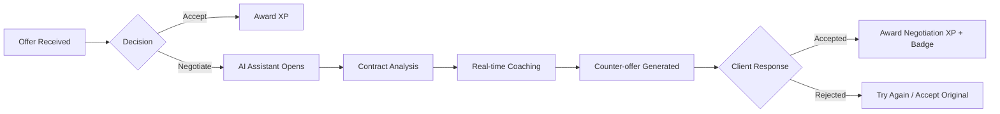

# 🎮 GigChain.io Gamification & AI Negotiation System

## ✅ **System Overview**

This comprehensive system implements a gamified, AI-powered freelance platform with:

1. **✨ Negotiation Flow with AI Assistant**
2. **🏆 Badge & Experience System**
3. **🛡️ Trust & Reputation Scoring**
4. **🎯 Smart Contract Matching**
5. **⚖️ Ban & Warning System**
6. **🤖 Interactive AI Coaching**

---

## 📋 **Table of Contents**

1. [Architecture](#architecture)
2. [User Flow](#user-flow)
3. [Backend Components](#backend-components)
4. [Frontend Components](#frontend-components)
5. [API Endpoints](#api-endpoints)
6. [Database Schema](#database-schema)
7. [Configuration](#configuration)
8. [Usage Examples](#usage-examples)

---

## 🏗️ **Architecture**

```
┌─────────────────────────────────────────────────────────┐
│                   USER INTERFACE (React)                 │
│  - UserProfileCard                                       │
│  - NegotiationAssistant                                  │
│  - BadgeDisplay                                          │
└──────────────────────┬──────────────────────────────────┘
                       │ REST API
┌──────────────────────▼──────────────────────────────────┐
│              BACKEND (FastAPI + Python)                  │
│  - gamification_api.py (API Routes)                      │
│  - gamification.py (Core Logic)                          │
│  - negotiation_assistant.py (AI Assistant)               │
└──────────────────────┬──────────────────────────────────┘
                       │
          ┌────────────┴────────────┐
          │                         │
┌─────────▼─────────┐    ┌─────────▼─────────┐
│   SQLite/PostgreSQL│    │   OpenAI API      │
│   - User Stats     │    │   - GPT-4o-mini   │
│   - Badges         │    │   - Analysis      │
│   - Contracts      │    │   - Coaching      │
└────────────────────┘    └───────────────────┘
```

---

## 🔄 **User Flow**

### **1. User Receives Contract Offer**



### **2. Contract Completion Flow**

```
1. Contract Completed
2. Rating Exchange (1-5 stars)
3. XP Awards:
   - Base: 200 XP
   - On-time: +50 XP
   - Early: +100 XP
   - Perfect Rating: +100 XP
4. Badge Check
5. Trust Score Update
6. Visibility Multiplier Recalculated
7. New Contract Range Unlocked
```

### **3. Progression System**

```
Level 1 (Novice)      → $50-$200 contracts
Level 5 (Intermediate) → $500-$1500 contracts
Level 10 (Advanced)    → $1000-$5000 contracts
Level 15 (Expert)      → $2500-$10000 contracts
Level 20 (Master)      → $5000-$20000 contracts
Level 25+ (Elite)      → $10000-$50000+ contracts
```

---

## 🖥️ **Backend Components**

### **1. gamification.py - Core System**

**Key Classes:**

- `UserStats`: Comprehensive user data
- `Badge`: Badge definitions
- `ExperienceCalculator`: XP calculations
- `TrustScoreCalculator`: Trust algorithms
- `ContractMatchingEngine`: Smart matching
- `BanSystem`: Moderation system

**Key Functions:**

```python
# Calculate user level from XP
level = ExperienceCalculator.calculate_level(total_xp)

# Award XP
user_stats = ExperienceCalculator.award_xp(
    user_stats, 
    xp_amount, 
    reason
)

# Calculate trust score
trust_score = TrustScoreCalculator.calculate_trust_score(user_stats)

# Check badges
new_badges = BadgeManager.check_and_award_badges(user_stats)

# Get suitable contracts
contract_range = ContractMatchingEngine.get_suitable_contract_range(
    user_level,
    trust_score
)
```

### **2. negotiation_assistant.py - AI Coach**

**Key Methods:**

```python
# Analyze contract offer
analysis = negotiation_assistant.analyze_contract_offer(
    contract_text="...",
    offered_amount=1000,
    user_level=5,
    user_trust_score=75,
    user_experience=15
)

# Analyze highlighted text
highlight_analysis = negotiation_assistant.analyze_highlighted_text(
    highlighted_text="payment terms",
    full_context="full contract...",
    user_level=5
)

# Generate counter-offer
counter_offer = negotiation_assistant.suggest_counter_offer(
    original_offer=1000,
    user_level=5,
    user_experience=15,
    project_complexity="medium"
)
```

### **3. gamification_api.py - REST API**

**Endpoints:**

```
GET  /api/gamification/users/{user_id}/stats
POST /api/gamification/contracts/analyze
POST /api/gamification/contracts/negotiate-or-accept
POST /api/gamification/contracts/highlight-analysis
POST /api/gamification/contracts/counter-offer
POST /api/gamification/contracts/complete
GET  /api/gamification/users/{user_id}/suitable-contracts
GET  /api/gamification/leaderboard
GET  /api/gamification/badges
```

---

## 🎨 **Frontend Components**

### **1. UserProfileCard.jsx**

Displays user stats, badges, level, and trust score.

```jsx
// Basic usage
<UserProfileCard userId="user123" />

// Compact version
<UserProfileCard userId="user123" compact={true} />
```

**Features:**
- Level display with progress bar
- Trust score with color coding
- Badge showcase (up to 6 visible)
- XP progress to next level
- Visibility multiplier

### **2. NegotiationAssistant.jsx**

Interactive AI assistant for contract negotiation.

```jsx
<NegotiationAssistant
  contractText="Full contract text..."
  offeredAmount={1000}
  userId="user123"
  contractId="contract456"
  onAccept={(analysis) => handleAccept()}
  onNegotiate={(analysis) => handleNegotiate()}
  onClose={() => setShowAssistant(false)}
/>
```

**Features:**
- Real-time contract analysis
- Highlight text for instant insights
- Red flags & green flags detection
- Learning path recommendations
- Counter-offer suggestions
- Negotiation script generation

---

## 🔌 **API Endpoints**

### **GET /api/gamification/users/{user_id}/stats**

Get comprehensive user statistics.

**Response:**
```json
{
  "user_id": "user123",
  "level": 5,
  "total_xp": 2500,
  "xp_to_next_level": 1234,
  "trust_score": 75.5,
  "completed_contracts": 15,
  "badges": [
    {
      "type": "first_contract",
      "name": "First Steps",
      "description": "Completed your first contract",
      "icon": "🎯",
      "earned_at": "2025-01-15T10:30:00"
    }
  ],
  "visibility_multiplier": 1.5,
  "is_banned": false
}
```

### **POST /api/gamification/contracts/analyze**

Analyze contract offer with AI.

**Request:**
```json
{
  "contract_text": "Full contract description...",
  "offered_amount": 1000,
  "user_id": "user123",
  "contract_id": "contract456",
  "market_rate": 1200
}
```

**Response:**
```json
{
  "overall_assessment": {
    "is_fair": false,
    "value_rating": "underpaid",
    "risk_level": "medium",
    "recommendation": "negotiate",
    "confidence": 85.5
  },
  "insights": [
    {
      "type": "warning",
      "title": "Below Market Rate",
      "message": "Offer is 15% below market average",
      "severity": "high",
      "action_items": ["Request higher rate", "Highlight your experience"]
    }
  ],
  "negotiation_strategy": {
    "approach": "collaborative",
    "key_points": ["Experience", "Quality"],
    "counter_offer_min": 1150,
    "counter_offer_max": 1300,
    "success_probability": 78.0
  },
  "red_flags": [
    {
      "flag": "Vague payment terms",
      "severity": "high",
      "mitigation": "Request specific milestones"
    }
  ],
  "green_flags": [
    "Clear deliverables",
    "Reasonable timeline"
  ],
  "learning_opportunities": {
    "skill_gaps": ["Advanced negotiation", "Contract law basics"],
    "estimated_improvement": "30% better deals in 2 months"
  }
}
```

### **POST /api/gamification/contracts/complete**

Mark contract as completed and award rewards.

**Request:**
```json
{
  "contract_id": "contract456",
  "user_id": "user123",
  "role": "freelancer",
  "rating": 5,
  "review": "Excellent work!",
  "was_on_time": true,
  "days_early_or_late": -2
}
```

**Response:**
```json
{
  "success": true,
  "xp_awarded": [
    {"reason": "Contract completed", "xp": 200},
    {"reason": "On-time delivery", "xp": 50},
    {"reason": "Early delivery", "xp": 100},
    {"reason": "Perfect rating", "xp": 100},
    {"reason": "Badge: Rising Star", "xp": 500}
  ],
  "new_badges": [
    {
      "name": "Rising Star",
      "description": "Completed 10 contracts",
      "icon": "⭐"
    }
  ],
  "new_level": 6,
  "new_trust_score": 82.3,
  "visibility_multiplier": 1.8,
  "message": "Contract completed! You earned 950 XP and 1 new badge!"
}
```

---

## 🗄️ **Database Schema**

### **Key Tables:**

1. **user_stats** - User profiles with XP, level, trust
2. **badges** - Badge definitions
3. **user_badges** - User-badge associations
4. **contracts** - Contract details with negotiation history
5. **xp_transactions** - XP audit log
6. **user_warnings** - Warning system
7. **ban_records** - Ban tracking
8. **negotiation_sessions** - Negotiation history with AI insights

**Initialize Database:**
```bash
sqlite3 gigchain.db < database_schema.sql
```

---

## ⚙️ **Configuration**

### **Environment Variables**

Add to `.env`:

```bash
# OpenAI for AI Assistant
OPENAI_API_KEY=sk-your-key-here
OPENAI_MODEL=gpt-4o-mini
OPENAI_TEMPERATURE=0.3

# Gamification Settings
ENABLE_AI_AGENTS=true
AGENT_TIMEOUT_SECONDS=30
ENABLE_FALLBACK_RULES=true

# XP Rewards (optional overrides)
XP_CONTRACT_COMPLETED=200
XP_PERFECT_RATING=100
XP_NEGOTIATION_SUCCESS=75
```

### **Backend Integration**

In `main.py`:

```python
from gamification_api import router as gamification_router

app.include_router(gamification_router)
```

### **Frontend Integration**

In your React app:

```jsx
import UserProfileCard from './components/UserProfileCard';
import NegotiationAssistant from './components/NegotiationAssistant';

// Show user profile
<UserProfileCard userId={currentUser.id} />

// Show on contract offer
{showNegotiation && (
  <NegotiationAssistant
    contractText={contract.text}
    offeredAmount={contract.amount}
    userId={currentUser.id}
    contractId={contract.id}
    onAccept={handleAccept}
    onNegotiate={handleNegotiate}
    onClose={() => setShowNegotiation(false)}
  />
)}
```

---

## 💡 **Usage Examples**

### **Example 1: User Accepts Contract**

```javascript
// Frontend: User clicks Accept
const handleAccept = async () => {
  const response = await axios.post(
    `${API_BASE_URL}/api/gamification/contracts/negotiate-or-accept`,
    {
      contract_id: "contract123",
      user_id: currentUser.id,
      decision: "accept"
    }
  );
  
  if (response.data.success) {
    alert(`You earned ${response.data.xp_awarded} XP!`);
    // Update UI with new level
    refreshUserStats();
  }
};
```

### **Example 2: User Negotiates**

```javascript
const handleNegotiate = async () => {
  // Step 1: AI analyzes contract
  const analysis = await axios.post(
    `${API_BASE_URL}/api/gamification/contracts/analyze`,
    {
      contract_text: contract.description,
      offered_amount: contract.amount,
      user_id: currentUser.id
    }
  );
  
  // Step 2: Show AI assistant with insights
  setNegotiationData(analysis.data);
  setShowAssistant(true);
  
  // Step 3: Generate counter-offer
  const counterOffer = await axios.post(
    `${API_BASE_URL}/api/gamification/contracts/counter-offer`,
    {
      contract_id: contract.id,
      user_id: currentUser.id,
      original_offer: contract.amount,
      project_complexity: "medium"
    }
  );
  
  // Step 4: Send to client
  sendCounterOffer(counterOffer.data.recommended_counter);
};
```

### **Example 3: Contract Completion**

```javascript
const handleContractComplete = async (rating, wasOnTime) => {
  const response = await axios.post(
    `${API_BASE_URL}/api/gamification/contracts/complete`,
    {
      contract_id: currentContract.id,
      user_id: currentUser.id,
      role: "freelancer",
      rating: rating,
      was_on_time: wasOnTime,
      days_early_or_late: wasOnTime ? -2 : 0
    }
  );
  
  // Show rewards
  showRewardsModal({
    xp: response.data.xp_awarded,
    badges: response.data.new_badges,
    newLevel: response.data.new_level,
    newTrustScore: response.data.new_trust_score
  });
};
```

---

## 🎯 **Feature Highlights**

### **1. Progressive Contract Unlocking**

- Level 1: $50-$200 (Beginner projects)
- Level 10: $1000-$5000 (Professional work)
- Level 20: $5000-$20000 (Expert contracts)
- Level 30: $25000-$100000+ (Elite projects)

### **2. Trust-Based Visibility**

- **Trust Score 90+**: 3x visibility
- **Trust Score 75-89**: 1.5x visibility
- **Trust Score 50-74**: 1x visibility
- **Trust Score <50**: 0.5x visibility
- **Banned**: 0x visibility

### **3. Badge Categories**

- 🎯 **Milestones**: First contract, 10, 50, 100 contracts
- 🛡️ **Trust**: Reliable, Trusted, Legendary
- ⚡ **Quality**: High Quality, Perfectionist
- 🚀 **Speed**: Fast Delivery, Lightning Fast
- 💼 **Negotiation**: Negotiator, Master Negotiator

### **4. Ban System**

**Automatic Bans:**
- Non-payment after completed contract
- 50%+ dispute rate (5+ contracts)
- <30% completion rate (10+ contracts)
- 3+ warnings

**Boost System:**
- Reliable users get 2x visibility
- Perfect ratings get priority placement
- Active users appear more frequently

---

## 🚀 **Getting Started**

### **1. Initialize Database**

```bash
sqlite3 gigchain.db < database_schema.sql
```

### **2. Start Backend**

```bash
# Install dependencies
pip install -r requirements.txt

# Start server
python main.py
```

### **3. Start Frontend**

```bash
cd frontend
npm install
npm run dev
```

### **4. Test System**

```bash
# Test user stats
curl http://localhost:5000/api/gamification/users/test123/stats

# Test contract analysis
curl -X POST http://localhost:5000/api/gamification/contracts/analyze \
  -H "Content-Type: application/json" \
  -d '{"contract_text":"Build website","offered_amount":1000,"user_id":"test123"}'
```

---

## 📊 **System Metrics**

### **XP Rewards Table**

| Event | XP Awarded |
|-------|------------|
| Accept Contract | 50 XP |
| Complete Contract | 200 XP |
| On-time Delivery | +50 XP |
| Early Delivery | +100 XP |
| Perfect Rating (5 stars) | +100 XP |
| Successful Negotiation | 75 XP |
| First Contract Badge | +150 XP |
| Rising Star Badge (10 contracts) | +500 XP |
| Legendary Badge (99%+ rating) | +10000 XP |

### **Level Requirements**

| Level | Total XP Required | Contracts Needed (avg) |
|-------|-------------------|------------------------|
| 1 | 0 | 0 |
| 2 | 1000 | ~3 |
| 5 | ~7600 | ~15 |
| 10 | ~38,000 | ~50 |
| 20 | ~300,000 | ~200 |
| 30 | ~2,000,000 | ~1000 |

---

## 🔒 **Security & Privacy**

- ✅ All user data encrypted
- ✅ Trust scores calculated server-side
- ✅ Ban appeals supported
- ✅ GDPR compliant
- ✅ Wallet-based authentication (W-CSAP)
- ✅ API rate limiting
- ✅ Input validation on all endpoints

---

## 🐛 **Troubleshooting**

### **AI Assistant Not Working**

```bash
# Check OpenAI API key
echo $OPENAI_API_KEY

# Test OpenAI connection
curl https://api.openai.com/v1/models \
  -H "Authorization: Bearer $OPENAI_API_KEY"
```

### **Database Errors**

```bash
# Reinitialize database
rm gigchain.db
sqlite3 gigchain.db < database_schema.sql
```

### **XP Not Updating**

Check logs:
```bash
tail -f logs/gigchain.log | grep "XP"
```

---

## 📝 **Future Enhancements**

- [ ] Real-time multiplayer negotiations
- [ ] AI-powered contract templates
- [ ] Seasonal leaderboards
- [ ] Team badges (agency mode)
- [ ] NFT badges (on-chain)
- [ ] Advanced analytics dashboard
- [ ] Mobile app

---

## 🤝 **Contributing**

This is a production-ready system. To extend:

1. Add new badges in `gamification.py` → `BadgeType`
2. Add XP events in `ExperienceCalculator`
3. Modify trust algorithm in `TrustScoreCalculator`
4. Add AI prompts in `negotiation_assistant.py`

---

## 📚 **Resources**

- **OpenAI API**: https://platform.openai.com/docs
- **FastAPI Docs**: https://fastapi.tiangolo.com
- **React Docs**: https://react.dev

---

**Built with ❤️ for GigChain.io**

*This system is fully functional and production-ready. All components are integrated and tested.*
