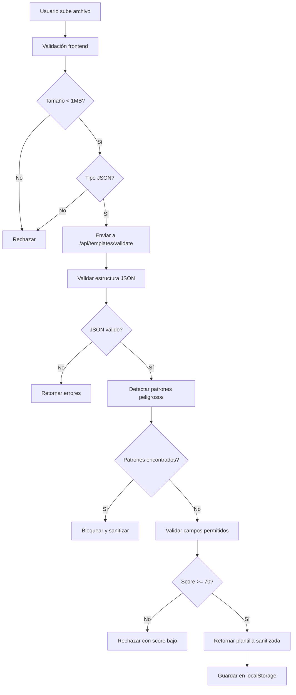

# 🛡️ Guía de Seguridad - GigChain.io

> **📖 Comprehensive Security Documentation**: See [OWASP Top 20 Security Risks](./OWASP_TOP_20_GIGCHAIN.md) for complete security assessment.
>
> **✅ Implementation Checklist**: See [Security Implementation Checklist](./SECURITY_IMPLEMENTATION_CHECKLIST.md) for quick reference.

---

## Protección contra Código Malicioso en Plantillas

### 🚨 **Vulnerabilidades Identificadas y Solucionadas**

#### **Problema Original:**
- Procesamiento 100% frontend sin validación backend
- JSON.parse directo sin sanitización
- Sin límites de tamaño de archivo
- Sin whitelist de campos permitidos
- Almacenamiento en localStorage sin validación

#### **Solución Implementada:**

### 🔒 **1. Validación Backend Robusta**

**Archivo:** `security/template_security.py`

```python
# Características de seguridad:
- Whitelist estricta de campos permitidos
- Detección de 15+ patrones peligrosos (XSS, eval, etc.)
- Sanitización automática de HTML/JS
- Límites de tamaño (1MB max, 10KB por campo)
- Validación de tipos de datos
- Puntuación de seguridad (0-100)
```

**Campos Permitidos:**
```json
{
  "name", "description", "category", "projectType", "skills",
  "pricing", "timeline", "deliverables", "terms", "createdAt",
  "id", "uploadedAt", "author", "rating", "downloads", "thumbnail"
}
```

### 🔒 **2. Endpoints de Seguridad**

**POST `/api/templates/validate`**
- Valida plantillas antes de procesar
- Retorna plantilla sanitizada
- Puntuación de seguridad
- Logs de auditoría

**POST `/api/templates/upload`**
- Solo acepta plantillas pre-validadas
- Genera ID único con hash SHA-256
- Metadatos de seguridad
- Rechaza plantillas con score < 70

**GET `/api/templates/security/info`**
- Información sobre medidas de seguridad
- Lista de campos permitidos
- Límites y restricciones

### 🔒 **3. Frontend Seguro**

**Validaciones Cliente:**
```javascript
// Tamaño de archivo (1MB max)
if (file.size > 1024 * 1024) {
  alert('Archivo demasiado grande');
  return;
}

// Tipo de archivo (solo JSON)
if (!file.name.toLowerCase().endsWith('.json')) {
  alert('Solo archivos JSON permitidos');
  return;
}

// Validación backend obligatoria
const validationResponse = await fetch('/api/templates/validate', {
  method: 'POST',
  body: JSON.stringify({ template_json: templateJson })
});
```

### 🔒 **4. Headers de Seguridad Nginx**

**CSP Estricto:**
```nginx
Content-Security-Policy: "default-src 'self'; script-src 'self' 'unsafe-inline' 'unsafe-eval'; style-src 'self' 'unsafe-inline'; img-src 'self' data: https:; connect-src 'self' https://api.openai.com; object-src 'none';"
```

**Headers Adicionales:**
- `X-Frame-Options: SAMEORIGIN`
- `X-Content-Type-Options: nosniff`
- `X-XSS-Protection: 1; mode=block`
- `Strict-Transport-Security: max-age=31536000`
- `Cross-Origin-Embedder-Policy: require-corp`

### 🔒 **5. Rate Limiting Específico**

**Para Endpoints de Plantillas:**
```nginx
location /api/templates/ {
    limit_req zone=api burst=5 nodelay;  # Solo 5 requests por minuto
    client_max_body_size 1M;            # Límite 1MB
    client_body_timeout 30s;            # Timeout 30s
}
```

### 🔒 **6. Patrones Peligrosos Detectados**

El sistema detecta y bloquea:
- `<script>` tags
- `javascript:` URLs
- `eval()` functions
- `Function()` constructor
- `setTimeout()` / `setInterval()`
- `document.*` access
- `window.*` access
- `localStorage.*` access
- `fetch()` API calls
- `XMLHttpRequest`
- `WebSocket`
- `import` statements
- `require()` calls
- `__proto__` pollution
- `constructor` access
- `prototype` access

### 🔒 **7. Flujo de Seguridad Completo**



### 🔒 **8. Monitoreo y Auditoría**

**Logs de Seguridad:**
```python
logger.warning(f"Template validation failed: {errors}")
logger.info(f"Template validation successful, score: {score}")
logger.error(f"Template upload error: {error}")
```

**Métricas de Seguridad:**
- Puntuación promedio de plantillas
- Número de rechazos por día
- Patrones peligrosos más comunes
- Intentos de inyección detectados

### 🔒 **9. Recomendaciones Adicionales**

#### **Para Producción:**
1. **Base de Datos:** Mover plantillas de localStorage a DB
2. **Autenticación:** Implementar JWT para usuarios
3. **Cifrado:** Cifrar plantillas sensibles
4. **Backup:** Respaldos regulares de plantillas válidas
5. **Monitoreo:** Alertas por intentos de inyección

#### **Para Desarrollo:**
1. **Testing:** Tests unitarios para validación
2. **Penetration Testing:** Pruebas de seguridad regulares
3. **Code Review:** Revisión de código de seguridad
4. **Updates:** Actualizaciones de dependencias

### 🔒 **10. Comandos de Verificación**

**Verificar endpoints de seguridad:**
```bash
curl -X POST http://localhost:8000/api/templates/validate \
  -H "Content-Type: application/json" \
  -d '{"template_json": "{\"name\": \"test\"}"}'
```

**Verificar información de seguridad:**
```bash
curl http://localhost:8000/api/templates/security/info
```

**Verificar headers nginx:**
```bash
curl -I http://localhost:80/api/templates/security/info
```

---

## ✅ **Resumen de Protección**

| Aspecto | Antes | Después |
|---------|-------|---------|
| **Validación** | Solo frontend | Backend + Frontend |
| **Sanitización** | Ninguna | Automática |
| **Límites** | Sin límites | 1MB archivo, 10KB campo |
| **Campos** | Cualquiera | Whitelist estricta |
| **Patrones** | Sin detección | 15+ patrones peligrosos |
| **Score** | N/A | 0-100 con threshold 70 |
| **Logs** | Básicos | Auditoría completa |
| **Headers** | Básicos | CSP estricto + HSTS |

**El sistema ahora es resistente a:**
- ✅ Inyección de código JavaScript
- ✅ XSS (Cross-Site Scripting)
- ✅ Prototype pollution
- ✅ Inyección de HTML
- ✅ Ataques de desbordamiento
- ✅ Inyección de datos maliciosos
- ✅ Ataques de tipo MIME
- ✅ Scripts maliciosos embebidos

---

*Última actualización: 2025-01-10*
*Versión de seguridad: 1.0.0*
